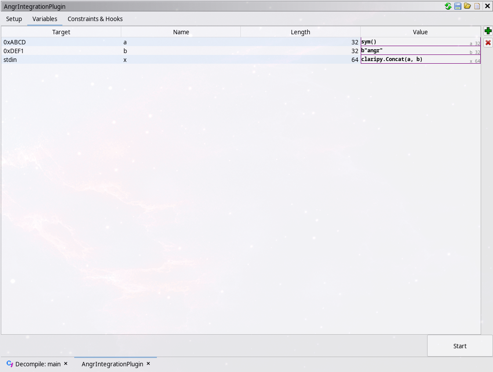
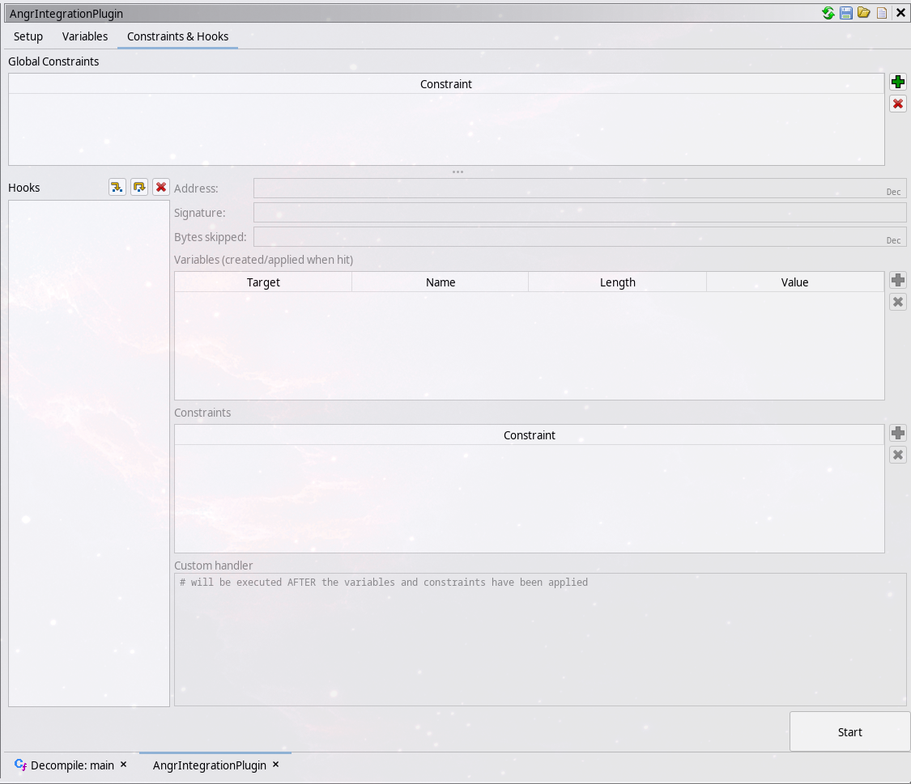
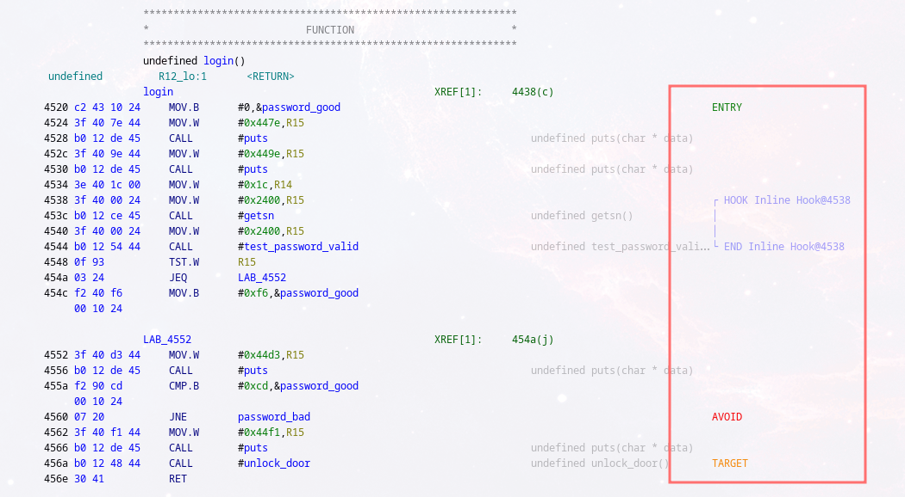

# Ghidra Angr Integration Tool

A plugin for Ghidra that provides access to the robust angr toolkit. This enables rapid, versatile, interactive symbolic
execution of binaries.

## 💻 Supported Archtectures

- Anything Ghidra supports! (even using custom architecture modules)

## 🔧 Requirements

- python >= 3.10 (currently untested on older versions)
- angr >= 9.2.117 (older versions will fail!)
- Ghidra 11.1.1

## ⬇️ Installation

- Create a new virtual environment and install `angr`:

```commandline
$ python -m venv .venv
$ source .venv/bin/activate
(.venv) $ pip install angr setuptools pypcode
```

- Install the extension into Ghidra, and enable it:

```raw
File -> Install Extensions -> Green plus icon -> check checkbox next to "ghidra-angr-integration-tool" and restart Ghidra
Program window -> File -> Configure -> Experimental -> check checkbox next to "AngrIntegrationPlugin" 
```

- Configure the extension to point to your created venv above:
    - In the program listing window, go to the `Edit -> Tool Options` dialog, select `angr Integration` from the right
      panel, and select the venv from the configuration box that appears.
    - If something goes wrong (e.g. the wrong version of angr is installed), the plugin will not accept the change,
      printing errors to the log and console.

## 🛡️ Security

Please note that by design, this plugin executes arbitrary Python 3 code from the user.

## More information

- [How to use angr's pcode backend](howto-angr.md)
- [A worked example](worked-example.md) of solving a CTF challenge with angr's pcode backend, and then with the Ghidra Angr Integration Tool.
- Information about the [design](DESIGN.md) of the Ghidra Angr Integration Tool.

## 📖 Usage


The plugin window should appear automatically when enabled. Otherwise, it should be an option under `Window ->
AngrIntegrationPlugin` in the main program window. The main window has three tabs:

- **Setup**: Set global configuration options such as entry point and behavior when completed
- **Variables**: Define symbolic variables and bind them to memory or registers at simulation start
- **Constraints & Hooks**: Define constraints that restrict the values of said symbolic variables and create hooks that
  can add new variables or constraints, or execute custom python code, when the program reaches a certain memory
  address

### Variables



The variables tab lets you define _symbolic variables_, which can be a concrete value, like `0x1234`, or symbolic,
meaning that the simulation will fork into multiple states whenever that value is read or depended on.

Each variable has four fields, all but Length being optional:

- **Target**: A memory address or register that the variable should be bound to. (Optional)
- **Name**: A unique identifier for this symbolic variable. Can be used to refer to this variable from constraints or
  the REPL. (Optional)
- **Length**: The size of this variable, in bits. (Required)
- **Value**: A python string that will be evaluated to construct the symbolic variable - see the below section for
  details! (Optional, if not provided will default to `sym()`)

When the simulation is started, each variable will be created and bound to it's target (if such a target exists). Note
that this binding is one-way -- if something then writes to a register or memory location, it will overwrite your bound
variable. However, the opposite also applies - if something reads your value, it will be propagated throughout the
program!

### Constraints



A constraint is a python expression that constrains the potential values of the symbolic variables of the program. For
example, if you have a variable representing some character of input, you could constrain it to only care about
printable or alphanumeric characters, using `is_printable(var)` or `is_alphanumeric(var)`. Again, the syntax for this is
explained below, but it should be familiar to anyone who has written python before.

### Hooks

A hook executes at a specific memory location and can either completely replace a method call or some section of
executable, or simply execute and then seamlessly return to simulation. There are two types of hook, with corresponding
capabilities:

#### Inline Hooks

An inline hook executes at a specific memory location, returning to that location plus some (possibly zero) offset. The
hook can:

- Add new symbolic variables and/or constraints
- Execute custom python code: using the custom handler you can modify any component of the state.

#### SimProcedure Hooks

SimProcedure hooks are significantly more powerful. They can similarly execute at any memory location, but if that is
the entry point of a function, they will (using the provided signature, in C syntax) marshall the arguements into python
types, which can be accessed inside the hook. They can do everything an inline hook does, as well as:

- Cause a function return, with specified return value
- Jump to a certain address, or even seamlessly call functions in the binary
- Fork execution into multiple successor states.

---

Whichever type of hook you end up using, you can set variables and constraints exactly as you would globally, and they
will only be added when/if execution of a state reaches that point. You may also write some custom python code, which
will be executed _after_ the variables and constraints have been added.

The "Custom handler" box is where you can write this code. It will execute in a context with some variables defined:
    - `st` is the current state;
    - `get_var()`, `get_vars()` are [convenience functions](#convenience-functions) for accessing the state's symbolic variables;
    - `brk()` is a [convenience function](#convenience-functions) for breaking out of the current angr simulation and into a REPL.

For further details on hooks, see [angr's documentation on the subject](https://docs.angr.io/en/latest/extending-angr/simprocedures.html)! (Note: when using
custom code in SimProcedure hooks, using the return statement will not work - to return a value, use `self.ret(value)`.)

Just like with symbolic constraints, you can access already-defined symbolic variables as if they were python locals.
You can also access the arguments of the function - just add the `_arg_` prefix to their names.

### 👩‍🔧 Setup options


Here, you can set the binary path (or toggle on the 'sync with Ghidra' option to have it automatically sync to the
currently opened program), the architecture (more on that below) and several other options:

- **Binary path**: The path to the binary to be analysed. Ghidra should autofill this, except in the case of a remote
  project where you don't have the binary on your machine.
- **Architecture**: The architecture specification to use. This tells angr information about the target platform, such
  as the calling convention or any special features to emulate. If this is an architecture angr supports well, you may
  have success with the 'Default' architecture, which lets angr figure things out for itself. Otherwise, you'll have to
  [write an architecture file](#-writing-architecture-files) and refresh the list of architectures.
- **Load external libraries**: This will instruct angr to look for any external shared libraries on your local system.
  **IMPORTANT: these may not be the same libraries that are loaded in your Ghidra project!**
- **Entry Point**: This specifies the initial simulation state:
    - **Entry State**: Enter simulation at `main` or other defined entry point, as if the program had just started being
    executed normally.
    - **Blank State**: Enter simulation at a state where everything (aside from the instruction pointer) is unbound. If
    using this, you may wish to setup the stack pointer to something reasonable (using the variables tab) or things may
    go wrong quickly.
    - **Call State**: Enter simulation as if a function had just been called, with (symbolic) arguments you can specify.
    If you put in an address that corresponds to a function that ghidra knows about, it will try to autofill the
    signature field with the signature it knows about. **Note: angr does not understand the placeholder type `undefined`
    that Ghidra uses.**
- **Exploration Goal**: This specifies the end goal at which simulation should terminate:
    - **Termination**: Stop executing when each fork of the state has terminated normally.
    - **Target Address**: Stop executing when any fork has reached one of a list of addresses.
    - **Unconstrained IP**: Stop executing if the instruction pointer ever becomes symbolic (with over 256 possible
    states)
    - **Custom**: Provide a python function that should return `True` if execution should stop.

- **Avoid addresses**: If any state tries to execute an address in this list, it will immediately be moved to the
  `avoid` stash, which will not be simulated any further.

- **Drop into REPL when done**: Enable this to open a python REPL window when simulation has concluded. Some variables will have been automatically populated in this environment.

- **Automatically show a solution for all variables when done**: Enable this to print every symbolic variable in each
  state along with a sample solution, if one exists. This can be quite computationally and memory intensive, so will
  automatically turn off if memory usage hits more than 95%.

- **Completion hook**: Place code here to be run as if it was in the REPL when simulation is complete. This is run
  regardless of if angr is configured to start the REPL or not. Note that the code is compiled before simulation starts
  -- this means that errors are caught early. Your code will run in a context where the variable `sm` is populated with the simulation manager that has just been executed.

To actually run `angr`, press the big `Start` button in the bottom right!

## 🔡 Symbolic Variable and Constraint Syntax

In the plugin UI, purple boxes denote symbolic variables, where you can define a symbolic variable using a python
expression. To make this consise, the environment these expressions are evaluated in has a few nice functions:

- `sym()`: Defines a new, blank symbolic variable. The `size` and `name` of the created variable can be defined using
  keyword arguments, but in lieu of those, the default size and name will be provided by the context of the field.
- `alloc(data)`: **Only works in the arguements to a call state!** Allocates some memory to store `data` in, then
  returns a pointer to the allocated memory.
- `sym_str(size, null=True)`: Creates a symbolic string of `size` length (plus a null terminator if `null` is True). As
  with `sym()` a `name` can also be provided. The returned variable will be a concatenation of each individual symbolic
  character.

Entries in a constraints table are also python expressions, with a different set of helper functions:

- `get_var(name, i)`: Get a single variable by it's name, returning either that variable or None if no variable goes by
  that name. If the name is that of a list of variables, for example a symbolic string, will return the first character
  of the list.
- `get_vars(name)`: Get a variable list by it's name. Returns a list of variables: either the empty list if the name
  does not point to a variable, or a singleton list if the name is that of a single variable, or the full list if the
  variable with that name is a list
- `is_*(var, allow_nulls=False)`: Generates (a set of) constraints to apply a condition to the symbolic variable or
  string `var`. Valid conditions are `printable`, `numeric`, `alphanumeric`, `alphabetic`, `uppercase`, `lowercase`.

These functions can also be used inside the REPL, with an additional initial parameter of the state to inspect. In
addition, some tricks are used to bring the names of every defined symbolic variable into scope, so if you've defined
some symbolic variable previously you can use it's name as if it was just a standard python variable.

In the REPL, there's an additional function `eval_vars(state, name)` that evaluates a whole symbolic string by name, and
casts it to `bytes` for ease of printing outputs.

For example, to constrain a symbolic variable `c` representing a single character to be alphabetical: `And(c >= 0x20, c
<= 0x7e)`. If you have a whole symbolic string and wish to constrain each character of it, returning a list of
constraints is also accepted: `[Or(And(c >= 0x20, c <= 0x7e), c == 0x0) for c in argument]` Note that **standard python
keywords `and` and `or`, `not` etc. will not work**, since you're manipulating symbolic constraints rather than real values.
Instead, use the functions `And()`, `Or()`, and `Not()` from `claripy`.

For more information on constructing constraints, see the [`claripy`
documentation](https://docs.angr.io/en/latest/appendix/ops.html).

## Convenience Functions

| Function            | Variable           | Constraint         | Hook               | REPL                | Description                                                 |
| ------------------- | ------------------ | ------------------ | ------------------ | ------------------- | ----------------------------------------------------------- |
| `sym`               | :heavy_check_mark: |                    |                    |                     | Creates a new symbolic variable                             |
| `alloc`             | :warning:¹         |                    |                    |                     | Allocates memory, returning a pointer to the passed data    |
| `sym_str`           | :heavy_check_mark: |                    |                    |                     | Creates a string of symbolic variables                      |
| `get_var`           | :heavy_check_mark: | :heavy_check_mark: | :heavy_check_mark: | :heavy_check_mark:² | Gets a symbolic variable by name                            |
| `get_vars`          | :heavy_check_mark: | :heavy_check_mark: | :heavy_check_mark: | :heavy_check_mark:² | Gets a symbolic string by name                              |
| `eval_vars`         |                    |                    |                    | :heavy_check_mark:  | Evaluates a symbolic varialbe or string to a concrete value |
| `brk`               |                    |                    | :heavy_check_mark: |                     | Immediately pauses simulation and opens a REPL              |
| Variables as locals | :heavy_check_mark: | :heavy_check_mark: | :heavy_check_mark: |                     | Access symbolic variables as if they were python locals     |

1. Only usable in argument definitions for a Call State
2. Requires additionally passing in the state to use

## 👩‍🏫 Examples

### Variable definitions

```python
sym()  # define a single symbolic variable
sym_str(10, name="arg1")  # define a symbolic string, 10 characters long, plus a null terminator, named arg1
0x3  # define a constant

claripy.Concat(x, y, z)  # concatenate three symbolic variables x, y, z to a longer one <x .. y .. z>

get_var(x)  # define this symbolic variable to be equal to x
x           # equivalent, less explicit form
```

### Conditions

```python
# Simple conditions
x != y
x >= 0x3
Or(x >= 0x3, x <= 20) # python infix keywords will NOT work

# List indexing works fine
arg1[3] == ord('5')

# constrain arg1 to be numeric
[Or(And(char >= 0x30, char <= 0x39), char == 0x0) for char in arg1]
```

### The REPL

```python
>>> s = sm.deadended[0]
>>> get_var(s, 'x')
<BV64 x_1>
>>> get_vars(s, 'arg1')  # with sym_str(4, name="arg1")
[<BV8 arg1_0_8>, <BV8 arg1_1_8>, <BV8 arg1_2_8>, <BV8 arg1_3_8>]

>>> eval_vars(s, 'arg1')
b'\x00\x00\x00\x00'
>>> s.solver.eval(claripy.Concat(*get_vars(s, "arg1")), cast_to=bytes)  # equivalently
b'\x00\x00\x00\x00'
```

## In-listing information



The plugin provides a listing field that displays the locations of most parts of the plugin that reference addresses. To
enable this, show the listing fields panel...
 

...and enable the field:


This can be positioned wherever you like, but placing at the end means it won't force a 2nd line for instructions it
shows up on.

## 📓 Writing architecture files

To write a custom architecture file, create a python file in `data/architectures` with the name of your architecture.
The file must contain a `get() -> architecture_interface.ArchitectureInterface` function that returns the custom arch
interface. Override functions in that class to define the useful things your architecture provides. Once you've written
a file, refresh the architecture list by clicking the refresh button in the top right of the plugin window, and it
should appear in the list! (A refresh is only required when a new file is added or removed - not when just edited.)

For information on creating `ExplorationTechinique`s, `SimProcedure`s, and custom calling conventions, see [the `angr`
documentation](https://docs.angr.io/en/latest/).
